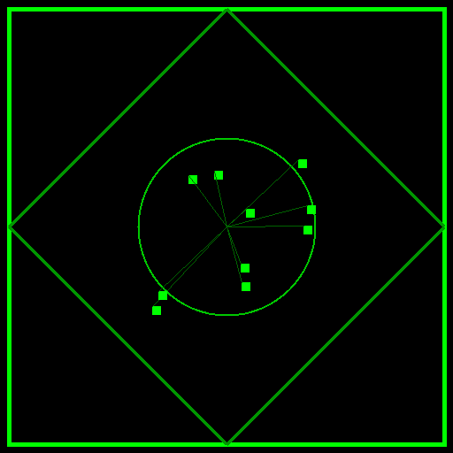

# Le Radici in Daniele: Il Sistema Operativo delle Profezie

> *Daniele scrive la versione 1.0 del codice profetico. Giovanni, secoli dopo nell'Apocalisse, installerà la versione 2.0. Il sistema operativo è lo stesso, cambiano solo gli imperi.*

## 1. La Statua dei Metalli (Il Codice Politico)

Nel Capitolo 2, il re Nabucodonosor sogna una statua che rappresenta la successione degli imperi umani. 

| Metallo | Regno Storico | Caratteristica |
| :--- | :--- | :--- |
| **Oro** (Testa) | Babilonia | Il più splendente, ma il più fragile. |
| **Argento** (Petti/Braccia) | Media-Persia | Inferiore al primo. |
| **Rame** (Ventre/Cosce) | Grecia | Veloce, espansivo. |
| **Ferro** (Gambe) | Roma | Spezza e frantuma tutto. |
| **Ferro + Argilla** (Piedi) | Roma Divisa | Forte ma instabile (connubi falliti). |

**La Pietra:** Una pietra staccata "senza mano d'uomo" colpisce i piedi della statua e la frantuma, diventando un monte che riempie la terra. È l'immagine del Regno di Dio, un potere non militare che distrugge i sistemi oppressivi.

## 2. Le Quattro Bestie dal Mare

Nel Capitolo 7, la prospettiva cambia. Quelli che agli occhi degli uomini sembravano gloriosi imperi metallici, agli occhi di Dio sono **bestie mostruose** che salgono dal caos (il mare).

1. **Leone alato:** Babilonia.
2. **Orso vorace:** Media-Persia.
3. **Leopardo a 4 teste:** Grecia (i 4 generali di Alessandro Magno).
4. **Bestia Terribile con 10 corna:** Roma e i re persecutori.

**Il Collegamento con l'Apocalisse:**
Giovanni, nel capitolo 13 dell'Apocalisse, fonde queste 4 bestie in **una sola Bestia dal mare** (ha il corpo di leopardo, le zampe di orso, la bocca di leone e 10 corna). Giovanni ci dice che il Male finale contiene tutto il male storico passato, cumulato in un unico sistema.

## 3. Il Figlio dell'Uomo sulle Nuvole

Sempre nel capitolo 7, appare *"uno simile a un figliuol d'uomo"* che viene sulle nuvole e riceve da Dio (il Vegliardo) un dominio eterno.

- **Il Paradosso:** I regni mondani sono descritti come bestie disumane, mentre il Regno di Dio ha un volto umano. Il potere non viene conquistato con la forza, ma viene *ricevuto*.
- Gesù userà questo esatto titolo nei Vangeli per indicare se stesso, non per umiltà, ma per rivendicare il ruolo di giudice cosmico.

## 4. La Matematica Sacra

Daniele introduce calcoli temporali che non servono per il calendario, ma per la teologia:

- **Un tempo, dei tempi e la metà d'un tempo:** (1 + 2 + 0,5 = 3,5 anni). È la metà esatta di 7 (il numero divino). Significa che il tempo del male e della persecuzione è *sempre a metà*, sempre incompiuto e limitato da Dio. 
- Giovanni prenderà questo "3,5" e lo tradurrà nell'Apocalisse in **1260 giorni** o **42 mesi**. È sempre lo stesso concetto: il male ha una scadenza.