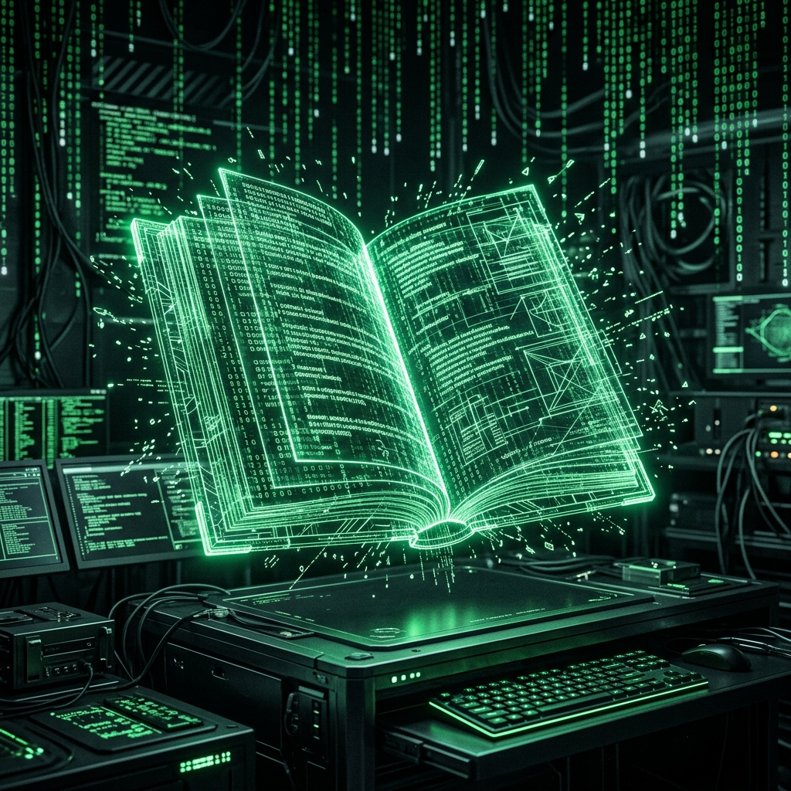

# I Segreti della Scrittura: Un Viaggio Oltre il Testo

> "Non c’è nulla di nascosto che non debba essere manifestato, né di segreto che non debba essere conosciuto."

Benvenuti in questo spazio di esplorazione.  
*I Segreti della Scrittura* non è un blog religioso tradizionale, ma un laboratorio di analisi profonda dedicato a scardinare i codici, le strutture e le simbologie nascoste nei testi biblici.

## La Nostra Missione
Il nostro obiettivo è guardare dove l’occhio pigro si ferma.  
Utilizziamo un approccio multidisciplinare per analizzare la Bibbia (nella versione riveduta del *Dott. Giovanni Luzzi*) non solo come testo sacro, ma come un complesso sistema di messaggi criptati, archetipi psicologici e mappe storiche.

Ci poniamo domande che sfidano il tempo:

- Qual è il vero “codice sorgente” delle visioni profetiche?
- Come si intrecciano la politica antica e la mistica nei numeri dell’Apocalisse?
- Quali strutture architettoniche collegano i profeti dell’Antico Testamento alle rivelazioni del Nuovo?

## Il Metodo: Uomo e Algoritmo
Questo progetto nasce da una collaborazione unica:  
un’architettura a “tre menti” che fonde l’intuito umano con la potenza di calcolo dell’Intelligenza Artificiale.

- Script in Python per estrarre testi e pattern dai documenti storici  
- Modalità Cavernicola (Caveman Mode) per ridurre il rumore e isolare l’essenza  
- Sintesi finale leggibile e profonda, dove il testo incontra il codice

📜 **Manifesto Ufficiale — I Segreti della Scrittura**  
*Dove il Testo finisce e il Codice comincia.*