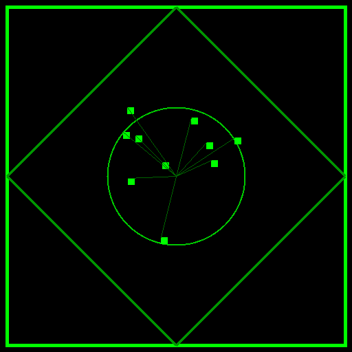

# I 5 Segreti di Isaia: La Mappa della Catastrofe

> *Considerato il "Quinto Vangelo", Isaia è un palinsesto vivo che nasconde le chiavi per comprendere la natura dell'Ego, del potere di Dio e della sofferenza redentrice.*

## 1. Il Codice "66" (La Struttura Frattale)

Il libro di Isaia è un microcosmo che riflette l'intera Bibbia:

- Ha **66 capitoli**, proprio come la Bibbia ha 66 libri.
- I **primi 39 capitoli** parlano di giudizio, legge e condanna (rispecchiando i 39 libri dell'Antico Testamento).
- Gli **ultimi 27 capitoli** (dal 40 al 66) cambiano tono, iniziando con *"Consolate, consolate il mio popolo"*, e parlano di grazia, salvezza e del Messia (rispecchiando i 27 libri del Nuovo Testamento).

## 2. Il Salto Temporale e i Due Autori

Leggendo attentamente la transizione tra il capitolo 39 e il 40, si nota una frattura netta. Il cap. 39 profetizza un disastro futuro (la deportazione a Babilonia). Il cap. 40 parla da *dentro* il disastro già avvenuto, 150 anni dopo, portando consolazione.

Il libro è una cucitura di epoche diverse: il *Proto-Isaia* (prima dell'esilio) e il *Deutero-Isaia* (durante l'esilio). La Bibbia si rivela come un documento che attraversa le generazioni.

## 3. Ciro: Il Messia Pagano (Cap. 45)

Dio chiama Ciro, re di Persia e politeista, il suo **"Unto"** (in ebraico *Mashiach*, Messia). È l'unica volta che un non-israelita riceve questo titolo. 

**Il Significato:** Dio non è ostaggio di nessuna religione. È il sovrano assoluto della storia e usa la geopolitica e leader profani per liberare il suo popolo.

## 4. La Sindrome di Lucifero (Cap. 14)

Un canto di scherno contro il re di Babilonia si trasforma nella prima vera indagine psicologica sull'Ego: *"Come mai sei caduto dal cielo, o astro mattutino... Tu dicevi in cuor tuo: Io salirò in cielo, sarò simile all'Altissimo"*. 

Questa è la nascita della figura di Lucifero: non solo un'entità, ma l'archetipo dell'hybris umana, la creatura che cerca di divorare il creatore e finisce per autodistruggersi.

## 5. Il Paradosso della Vittoria per Implosione (Cap. 53)

Il famoso testo del "Servo Sofferente". L'intervento salvifico di Dio non è descritto come un trionfo militare, ma come un uomo *"disprezzato e abbandonato... trafitto a motivo delle nostre trasgressioni"*.

Il vero segreto di Isaia è il capovolgimento di ogni mitologia: l'eroe non vince uccidendo, ma assorbendo il male del mondo come una spugna, lasciandosi spezzare. La sofferenza innocente diventa il meccanismo cosmico di espiazione collettiva.

**Il Ceppo Bruciato (Cap. 6):** La mappa della catastrofe di Isaia ci insegna che quando la foresta brucia, rimane un ceppo morto che nasconde un "seme santo". La resurrezione non si ottiene evitando il fuoco, ma attraversandolo.

